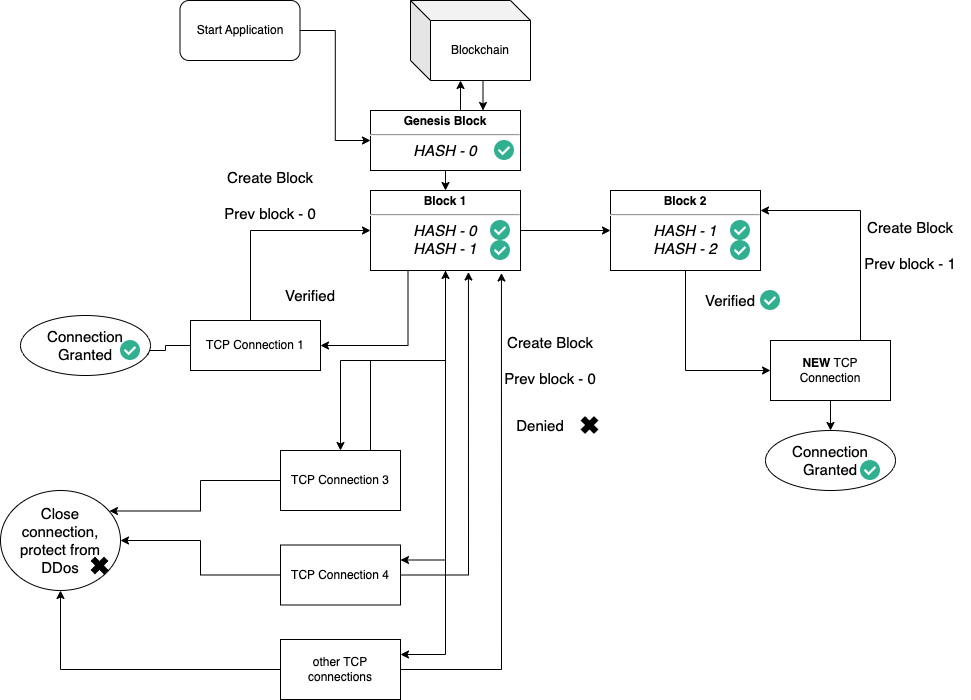

# TCP-protected-by-PoW

## Details
• TCP server should be protected from DDOS attacks with the Prof of Work (https://en.wikipedia.org/wiki/Proof_of_work), the challenge-response protocol should be used.

• The choice of the POW algorithm should be explained.

• After Prof Of Work verification, server should send one of the quotes from “word of wisdom” book or any other collection of the quotes.

• Docker file should be provided both for the server and for the client that solves the POW challenge
 
By default the server runs on the port 8080 and the client picks an ephemeral port and connects to the server.

## PoW explanation

When a connection is opened, a block is trying to be mined, and block includes information about the connection.

In PoW, it takes time to create a block, verify, and write it to the blockchain.

If at the moment when the previous block did not write,  and new connections openning (DDOS attack), block of these connections will have an incorrect hash, and it willn't veryfied.

This will generate an error and terminate the connection. Thus, the situation of DDoS attacks will be eliminated.
 
 
For testing Server:

`nc localhost 8080`

